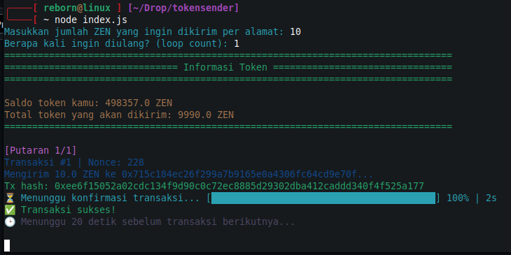

# MULTISEND-TOKEN

<p align="center">
  
</p>

Multi Send Token All Chain  
Tool CLI untuk mengirim token ZEN (dan token lain) ke banyak alamat sekaligus dengan mudah dan cepat.

---

## Fitur Utama

- Kirim token ke banyak alamat sekaligus (multi-send)  
- Bisa loop transaksi sesuai keinginan  
- Menampilkan nonce dan status transaksi secara realtime  
- Delay antar transaksi supaya aman dan terhindar dari error nonce  
- Support otomatis load alamat dari file `.txt`  

---

## Prasyarat

- Node.js (versi 16 ke atas disarankan)  
- npm atau yarn  
- File `.env` dengan konfigurasi RPC dan private key  
- File alamat tujuan (misal: `address.txt`), format 1 alamat per baris

---

## Instalasi

1. Clone repo ini
```shell
git clone https://github.com/syahrulrzk/tokensender.git
cd tokensender
```

2. Install dependencies
```shell
npm install
```

3. Siapkan file .env di folder root, `nano .env` contoh:
```shell
RPC_URL=https://your-rpc-url
PRIVATE_KEY=your-private-key tanpa 0x
TOKEN_ADDRESS=0xYourTokenContractAddress
```
4. Siapkan file alamat tujuan address.txt, contoh:
```shell
0x715c184ec26f299a7b9165e0a4306fc64cd9e70f
0xfb19ffd1ff9316b7f5bba076ef4b78e4bbedf4e1
...
```

## Cara Menjalankan
Jalankan perintah berikut dan ikuti instruksi input:

```shell
node index.js
```

Kamu akan diminta untuk input:

- Jumlah token yang ingin dikirim per alamat
- Berapa kali transaksi diulang (loop count)

Contoh output transaksi:
<p align="center">
  
</p>

